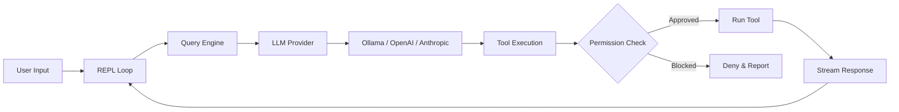

<p align="center">
  
</p>

# OpenHarness

```
        ___
       /   \
      (     )        ___  ___  ___ _  _ _  _   _ ___ _  _ ___ ___ ___
       `~w~`        / _ \| _ \| __| \| | || | /_\ | _ \ \| | __/ __/ __|
       (( ))       | (_) |  _/| _|| .` | __ |/ _ \|   / .` | _|\__ \__ \
        ))((        \___/|_|  |___|_|\_|_||_/_/ \_\_|_\_|\_|___|___/___/
       ((  ))
        `--`
```

AI coding agent in your terminal. Works with any LLM -- free local models or cloud APIs.

<p align="center">
  
</p>

[](https://www.npmjs.com/package/@zhijiewang/openharness) [](https://www.npmjs.com/package/@zhijiewang/openharness) [](LICENSE)     [](https://github.com/zhijiewong/openharness) [](https://github.com/zhijiewong/openharness/issues) [](https://github.com/zhijiewong/openharness/pulls)

**English** | [简体中文](README.zh-CN.md)

---

## Table of Contents

- [Quick Start](#quick-start)
- [Why OpenHarness?](#why-openharness)
- [Terminal UI](#terminal-ui)
- [Tools (44)](#tools-43)
- [Slash Commands](#slash-commands)
- [Permission Modes](#permission-modes)
- [Hooks](#hooks)
- [Checkpoints & Rewind](#checkpoints--rewind)
- [Agent Roles](#agent-roles)
- [Headless Mode & CI/CD](#headless-mode)
- [Cybergotchi](#cybergotchi)
- [MCP Servers](#mcp-servers)
- [Providers](#providers)
- [Auth](#auth)
- [Update](#update)
- [FAQ](#faq)
- [Install](#install)
- [Development](#development)
- [Contributing](#contributing)
- [Community](#community)

---

## Quick Start

```bash
npm install -g @zhijiewang/openharness
oh
```

That's it. OpenHarness auto-detects Ollama and starts chatting. No API key needed.

**Python SDK:** there's also an official Python SDK for driving `oh` from Python programs (notebooks, batch scripts, ML pipelines). Install with `pip install openharness-sdk` after the npm install (the PyPI distribution is `openharness-sdk` because the unqualified name is taken), then `from openharness import query`. See [`python/README.md`](python/README.md).

**TypeScript SDK:** drive `oh` from Node.js (VS Code extensions, Electron apps, build scripts) with `@zhijiewang/openharness-sdk` — `npm install @zhijiewang/openharness-sdk`, then `import { query, OpenHarnessClient, tool } from "@zhijiewang/openharness-sdk"`. Mirrors the Python SDK surface (streaming events, stateful sessions, custom tools, permission callback, session resume). See [`packages/sdk/README.md`](packages/sdk/README.md).

```bash
oh init                               # interactive setup wizard (provider + cybergotchi)
oh                                    # auto-detect local model
oh --model ollama/qwen2.5:7b         # specific model
oh --model gpt-4o                     # cloud model (needs OPENAI_API_KEY)
oh --trust                            # auto-approve all tool calls
oh --auto                             # auto-approve, block dangerous bash
oh -p "fix the tests" --trust         # headless mode (single prompt, exit)
oh run "review code" --json           # CI/CD with JSON output
```

**In-session commands:**
```
/rewind                               # undo last AI file change (checkpoint restore)
/roles                                # list agent specializations
/vim                                  # toggle vim mode
Ctrl+O                                # flush transcript to scrollback for review
```

## Why OpenHarness?

Most AI coding agents are locked to one provider or cost $20+/month. OpenHarness works with any LLM -- run it free with Ollama on your own machine, or connect to any cloud API. Every AI edit is git-committed and reversible with `/undo`.

## Terminal UI

OpenHarness features a sequential terminal renderer inspired by Ink/Claude Code's default mode. Completed messages flush to native scrollback (scrollable), while the live area (streaming, spinner, input) rewrites in-place using relative cursor movement.

### Keybindings

| Key | Action |
|-----|--------|
| `Enter` | Submit prompt |
| `Alt+Enter` | Insert newline (multi-line input) |
| `↑` / `↓` | Navigate input history |
| `Ctrl+C` | Cancel current request / exit |
| `Ctrl+A` / `Ctrl+E` | Jump to start / end of input |
| `Ctrl+O` | Toggle thinking block expansion |
| `Ctrl+K` | Toggle code block expansion in messages |
| `Tab` | Autocomplete slash commands / file paths / cycle tool outputs |
| `/vim` | Toggle Vim mode (normal/insert) |

Scrolling is handled by the terminal's native scrollbar. Completed messages flow into the terminal scrollback buffer. Use your terminal's search (e.g., `Ctrl+Shift+F` in VS Code) to search conversation history.

### Features

- **Markdown rendering** — headings, code blocks, bold, italic, lists, tables, blockquotes, links
- **Syntax highlighting** — keywords, strings, comments, numbers, types (JS/TS/Python/Rust/Go and 20+ languages)
- **Collapsible code blocks** — blocks over 8 lines auto-collapse; `Ctrl+K` to expand all
- **Collapsible thinking** — thinking blocks collapse to a one-line summary after completion; `Ctrl+O` to expand
- **Shimmer spinner** — animated indicator with stage label (`Thinking`, `Running <Tool>`, `Calling <server>:<tool>`, `Running N tools`) and color transitions (magenta → yellow at 30s → red at 60s)
- **Tool call display** — args preview, live streaming output, result summaries (line counts, elapsed time), expand/collapse with `Tab`. Tool name color-coded by category (read tools cyan, mutating tools yellow, exec tools magenta, MCP tools green)
- **Rich tool output** — JSON files render as a colored static tree (depth-3 collapse, line truncation); markdown files render with full styling (headings, code blocks, tables) instead of plain split-on-newline. Renderer dispatches via `outputType` field stamped by FileReadTool / WebFetchTool, with a heuristic fallback for unstamped tools
- **Nested tool calls** — when `Agent` or `ParallelAgents` spawns inner tool calls (Read, Bash, Edit), the children render indented under their spawning parent. ParallelAgents shows per-task `Task` wrapper rows so child calls group by task instead of flat under the bundled parent. Depth-3 indent limit with `… (N more level)` collapse marker
- **Multi-line input wrap glyph** — every non-last line of a multi-line input ends with a dim `↵` continuation marker so the wrap is visually obvious
- **Permission prompts** — bordered box with risk coloring, bold colored **Y**es/**N**o/**D**iff keys, syntax-highlighted inline diffs
- **Status line** — model name, token count, cost, context usage bar (customizable via config)
- **Context warning** — yellow alert when context window exceeds 75%
- **Native terminal scrollbar** — completed messages flow into scrollback; use your terminal's scrollbar and search
- **Multi-line input** — `Alt+Enter` for newlines; paste detection auto-inserts newlines
- **Autocomplete** — slash commands and file paths with descriptions; Tab to cycle
- **File path autocomplete** — Tab-completes paths with `[dir]`/`[file]` indicators
- **Session browser** — `/browse` to interactively browse and resume past sessions
- **Companion mascot** — animated Cybergotchi in the footer (toggle with `/companion off|on`)

### Themes

```bash
oh --light                    # light theme for bright terminals
/theme light                  # switch mid-session (saved automatically)
/theme dark                   # switch back
```

Theme preference is saved to `.oh/config.yaml` and persists across sessions.

### Custom Status Line

Customize the status bar format in `.oh/config.yaml`:

```yaml
statusLineFormat: '{model} │ {tokens} │ {cost} │ {ctx}'
```

Available variables: `{model}`, `{tokens}` (input↑ output↓), `{cost}` ($X.XXXX), `{ctx}` (context usage bar). Empty sections are automatically collapsed.

## Tools (44)

| Tool | Risk | Description |
|------|------|-------------|
| **Core** | | |
| Bash | high | Execute shell commands with live streaming output (AST safety analysis) |
| PowerShell | high | Execute PowerShell commands (Windows-native scripting) |
| Read | low | Read files with line ranges, PDF support |
| ImageRead | low | Read images/PDFs for multimodal analysis |
| Write | medium | Create or overwrite files |
| Edit | medium | Search-and-replace edits |
| MultiEdit | medium | Atomic multi-file edits (all succeed or none) |
| Glob | low | Find files by pattern |
| Grep | low | Regex content search with context lines |
| LS | low | List directory contents with sizes |
| **Web** | | |
| WebFetch | medium | Fetch URL content (SSRF-protected) |
| WebSearch | medium | Search the web |
| ExaSearch | medium | Neural web search via Exa (requires `EXA_API_KEY`) |
| RemoteTrigger | high | HTTP requests to webhooks/APIs |
| **Tasks** | | |
| TaskCreate | low | Create structured tasks |
| TaskUpdate | low | Update task status |
| TaskList | low | List all tasks |
| TaskGet | low | Get task details |
| TaskStop | low | Stop a running task |
| TaskOutput | low | Get task output |
| TodoWrite | low | Manage session task checklist (Claude Code-compatible) |
| **Agents** | | |
| Agent | medium | Spawn a sub-agent (with role specialization) |
| ParallelAgent | medium | Dispatch multiple agents with DAG dependencies |
| SendMessage | low | Agent-to-agent peer messaging |
| AskUser | low | Ask user a question with options |
| **Scheduling** | | |
| CronCreate | medium | Schedule recurring tasks |
| CronDelete | medium | Remove scheduled tasks |
| CronList | low | List all scheduled tasks |
| ScheduleWakeup | low | Self-pace the next /loop iteration (cache-aware) |
| **Planning** | | |
| EnterPlanMode | low | Enter structured planning mode |
| ExitPlanMode | low | Exit planning mode |
| **Pipelines** | | |
| Pipeline | medium | Run a sequence of tasks with output passed between steps |
| **Code Intelligence** | | |
| Diagnostics | low | LSP-based code diagnostics |
| NotebookEdit | medium | Edit Jupyter notebooks |
| **Memory & Discovery** | | |
| Memory | low | Save/list/search persistent memories |
| Skill | low | Invoke a skill from .oh/skills/ |
| ToolSearch | low | Find tools by description |
| SessionSearch | low | Search prior sessions for relevant context |
| **MCP** | | |
| ListMcpResources | low | List resources from connected MCP servers |
| ReadMcpResource | low | Read a specific MCP resource by URI |
| **Git Worktrees** | | |
| EnterWorktree | medium | Create isolated git worktree |
| ExitWorktree | medium | Remove a git worktree |
| **Process** | | |
| KillProcess | high | Stop processes by PID or name |
| Monitor | medium | Run a background command and stream each output line back to the agent |

Low-risk read-only tools auto-approve. Medium and high risk tools require confirmation in `ask` mode. Use `--trust` or `--auto` to skip prompts.

## Slash Commands

Over 80 commands are registered. The most-used ones are grouped below; see `/help` in-session for the full list. Aliases: `/q` exit, `/h` help, `/c` commit, `/m` model, `/s` status.

**Session:**
| Command | Description |
|---------|-------------|
| `/clear` | Clear conversation history |
| `/compact` | Compress conversation to free context |
| `/export` | Export conversation to markdown |
| `/copy [n]` | Copy the Nth-last assistant response to the system clipboard |
| `/history [n]` | List recent sessions; `/history search <term>` to search |
| `/browse` | Interactive session browser with preview |
| `/resume <id>` | Resume a saved session |
| `/fork` | Fork current session |

**Git:**
| Command | Description |
|---------|-------------|
| `/diff` | Show uncommitted git changes |
| `/undo` | Undo last AI commit |
| `/commit [msg]` | Create a git commit |
| `/log` | Show recent git commits |

**Info:**
| Command | Description |
|---------|-------------|
| `/help` | Show all available commands (categorized) |
| `/cost` | Show session cost and token usage |
| `/status` | Show model, mode, git branch, MCP servers |
| `/config` | Show configuration |
| `/files` | List files in context |
| `/model <name>` | Switch model mid-session |
| `/memory` | View and search memories |
| `/doctor` | Run diagnostic health checks |
| `/hooks` | List loaded hooks grouped by event |
| `/reload-plugins` | Hot-reload plugins, skills, hooks, and MCP server connections without restarting the session |

**Settings:**
| Command | Description |
|---------|-------------|
| `/theme dark\|light` | Switch theme (saved to config) |
| `/vim` | Toggle Vim mode |
| `/companion off\|on` | Toggle companion visibility |
| `/keys` | Show keyboard shortcuts |
| `/keybindings` | Open `~/.oh/keybindings.json` in `$EDITOR` (creates a starter file if missing) |

**AI:**
| Command | Description |
|---------|-------------|
| `/plan <task>` | Enter plan mode |
| `/review` | Review recent code changes |
| `/summarize` | Summarize the current conversation |
| `/recap` | One-sentence recap of the session (lighter than `/summarize`) |

**Pet:**
| Command | Description |
|---------|-------------|
| `/cybergotchi` | Feed, pet, rest, status, rename, or reset your companion |

## Permission Modes

Control how aggressively OpenHarness auto-approves tool calls:

| Mode | Flag | Behavior |
|------|------|----------|
| `ask` | `--permission-mode ask` | Prompt for medium/high risk operations (default) |
| `trust` | `--trust` | Auto-approve everything |
| `deny` | `--deny` | Only allow low-risk read-only operations |
| `acceptEdits` | `--permission-mode acceptEdits` | Auto-approve file edits, ask for Bash/WebFetch/Agent |
| `plan` | `--permission-mode plan` | Read-only mode — block all write operations |
| `auto` | `--auto` | Auto-approve all, block dangerous bash (AST-analyzed) |
| `bypassPermissions` | `--permission-mode bypassPermissions` | Approve everything unconditionally (CI only) |

Bash commands are analyzed by a lightweight AST parser that detects destructive patterns (`rm -rf`, `git push --force`, `curl | bash`, etc.) and adjusts risk level accordingly.

Set permanently in `.oh/config.yaml`: `permissionMode: 'acceptEdits'`

## Hooks

Run shell scripts automatically at key session events by adding a `hooks` block to `.oh/config.yaml`:

```yaml
hooks:
  - event: sessionStart
    command: "echo 'Session started' >> ~/.oh/session.log"

  - event: preToolUse
    command: "scripts/check-tool.sh"
    match: Bash   # optional: only trigger for this tool name

  - event: postToolUse
    command: "scripts/after-tool.sh"

  - event: sessionEnd
    command: "scripts/cleanup.sh"
```

**Event types** (27 total — matches Claude Code's stable surface):

| Event | When it fires | Can block? |
|-------|---------------|------------|
| `sessionStart` | Session begins | — |
| `sessionEnd` | Session ends | — |
| `turnStart` | Top-level agent turn begins (after user prompt accepted) | — |
| `turnStop` | Top-level agent turn ends (mirrors Claude Code's `Stop`) | — |
| `userPromptSubmit` | Before user prompt reaches the LLM | yes — `decision: deny` |
| `userPromptExpansion` | Slash command produces an expanded prompt (audit trail) | — |
| `preToolUse` | Before each tool call | yes — exit code 1 / `decision: deny` |
| `postToolUse` | After successful tool execution | — |
| `postToolUseFailure` | After tool throws or returns `isError: true` | — |
| `postToolBatch` | Once after a turn's full set of tool calls all resolve, before the next model call | — |
| `permissionRequest` | When a tool needs approval (between `preToolUse` and the prompt) | yes — `decision: allow\|deny\|ask` |
| `permissionDenied` | When a tool call is denied (hook / user / headless / policy) | — |
| `fileChanged` | After a tool modifies a file | — |
| `cwdChanged` | After working directory changes | — |
| `subagentStart` | A sub-agent is spawned | — |
| `subagentStop` | A sub-agent completes | — |
| `preCompact` | Before conversation compaction | — |
| `postCompact` | After conversation compaction | — |
| `configChange` | `.oh/config.yaml` is modified during the session | — |
| `notification` | A notification is dispatched | — |
| `taskCreated` | `TaskCreate` persists a new task | — |
| `taskCompleted` | `TaskUpdate` transitions a task to `completed` | — |
| `worktreeCreate` | `EnterWorktreeTool` creates an isolated git worktree | — |
| `worktreeRemove` | `ExitWorktreeTool` removes a git worktree | — |
| `elicitation` | An MCP server requests user input via `elicitation/create` | yes — `decision: allow\|deny` |
| `elicitationResult` | After the elicitation response has been decided (audit trail) | — |
| `instructionsLoaded` | `loadRulesAsPrompt` rebuilt the system prompt with rules in scope | — |

Set `disableAllHooks: true` in `.oh/config.yaml` to globally disable hook execution while keeping definitions on disk for auditability.

Live introspection: run `/hooks` in-session to see exactly which hooks are loaded, grouped by event.

**Environment variables** available to hook scripts:

| Variable | Description |
|----------|-------------|
| `OH_EVENT` | Event type (`sessionStart`, `preToolUse`, etc.) |
| `OH_TOOL_NAME` | Name of the tool being called (tool events only) |
| `OH_TOOL_ARGS` | JSON-encoded tool arguments (tool events only) |
| `OH_TOOL_OUTPUT` | JSON-encoded tool output (`postToolUse` only) |
| `OH_TOOL_INPUT_JSON` | Full JSON tool input (tool events only) |
| `OH_SESSION_ID` / `OH_MODEL` / `OH_PROVIDER` / `OH_PERMISSION_MODE` | Current session context |
| `OH_COST` / `OH_TOKENS` | Running cost and token totals |
| `OH_FILE_PATH` | Path that changed (`fileChanged` only) |
| `OH_NEW_CWD` | New working directory (`cwdChanged` only) |
| `OH_TURN_NUMBER` / `OH_TURN_REASON` | Turn boundary context (`turnStart` / `turnStop`) |

Use `match` to restrict a hook to a specific tool name (e.g., `match: Bash` only triggers for the Bash tool). Substring, glob (`Cron*`), and `/regex/flags` patterns are all supported.

Set `jsonIO: true` on a `command` hook to opt into structured JSON I/O — the harness sends `{event, ...context}` on stdin and reads `{decision, reason, hookSpecificOutput}` from stdout. HTTP hooks accept the same response shape. See [docs/hooks.md](docs/hooks.md) for the full reference.

## Cybergotchi

OpenHarness ships with a Tamagotchi-style companion that lives in the side panel. It reacts to your session in real time — celebrating streaks, complaining when tools fail, and getting hungry if you ignore it.

**Hatch one:**
```
oh init        # wizard includes cybergotchi setup
/cybergotchi   # or hatch mid-session
```

**Commands:**
```
/cybergotchi feed      # +30 hunger
/cybergotchi pet       # +20 happiness
/cybergotchi rest      # +40 energy
/cybergotchi status    # show needs + lifetime stats
/cybergotchi rename    # give it a new name
/cybergotchi reset     # start over with a new species
```

**Needs** decay over time (hunger fastest, happiness slowest). Feed and pet your gotchi to keep it happy.

**Evolution** — your gotchi evolves based on lifetime milestones:
- Stage 1 (✦ magenta): 10 sessions or 50 commits
- Stage 2 (★ yellow + crown): 100 tasks completed or a 25-tool streak

**18 species** to choose from: duck, cat, owl, penguin, rabbit, turtle, snail, octopus, axolotl, cactus, mushroom, chonk, capybara, goose, and more.

## MCP Servers

Connect any MCP (Model Context Protocol) server by editing `.oh/config.yaml`:

```yaml
provider: anthropic
model: claude-sonnet-4-6
permissionMode: ask
mcpServers:
  - name: filesystem
    command: npx
    args: ["-y", "@modelcontextprotocol/server-filesystem", "/tmp"]
  - name: github
    command: npx
    args: ["-y", "@modelcontextprotocol/server-github"]
    env:
      GITHUB_PERSONAL_ACCESS_TOKEN: ghp_...
```

MCP tools appear alongside built-in tools. `/status` shows connected servers.

**MCP server prompts as slash commands** — servers that expose `prompts/list` (e.g., GitHub, Sentry, Linear) get their prompts surfaced as `/<server>:<prompt>` slash commands automatically. Arguments use a `key=value` syntax with quoting:

```
/github:summarize-pr repo=acme/widget pr=42
/sentry:triage-issue issue=ABC-123 severity="high priority"
```

Required arguments declared by the prompt template surface a usage error if missing (no model call). Run `/reload-plugins` to re-discover prompts after editing your MCP config.

### Remote MCP servers (HTTP / SSE)

```yaml
mcpServers:
  - name: linear
    type: http
    url: https://mcp.linear.app/mcp
    headers:
      Authorization: "Bearer ${LINEAR_API_KEY}"
```

See [docs/mcp-servers.md](docs/mcp-servers.md) for the full reference.
See [docs/mcp-servers.md](docs/mcp-servers.md#authentication) for OAuth 2.1 setup (auto-triggered on 401; `/mcp-login` and `/mcp-logout` commands available).

**MCP Server Registry** — browse and install from a curated catalog:

```
/mcp-registry              # browse all available servers
/mcp-registry github       # show install config for a specific server
/mcp-registry database     # search by category
```

Categories: filesystem, git, database, api, search, productivity, dev-tools, ai.

## Git Integration

OpenHarness auto-commits AI edits in git repos:

```
oh: Edit src/app.ts                    # auto-committed with "oh:" prefix
oh: Write tests/app.test.ts
```

- Every AI file change is committed automatically
- `/undo` reverts the last AI commit (only OH commits, never yours)
- `/diff` shows what changed
- Your dirty files are safe — committed separately before AI edits

## Checkpoints & Rewind

Every file modification is automatically checkpointed before execution. If something goes wrong:

```
/rewind           # restore files from the last checkpoint
/undo             # revert the last AI git commit
```

Checkpoints are stored in `.oh/checkpoints/` and cover FileWrite, FileEdit, and Bash commands that modify files.

## Verification Loops

After every file edit (Edit, Write, MultiEdit), openHarness automatically runs language-appropriate lint/typecheck commands and feeds the results back into the agent context. This is the single highest-impact harness engineering pattern — research shows 2-3x quality improvement from automated feedback.

**Auto-detection** — if your project has `tsconfig.json`, `.eslintrc*`, `pyproject.toml`, `go.mod`, or `Cargo.toml`, verification rules are detected automatically. No configuration needed.

**Custom rules** via `.oh/config.yaml`:

```yaml
verification:
  enabled: true       # default: true (auto-detect)
  mode: warn          # 'warn' appends to output, 'block' marks as error
  rules:
    - extensions: [".ts", ".tsx"]
      lint: "npx tsc --noEmit 2>&1 | head -20"
      timeout: 15000
    - extensions: [".py"]
      lint: "ruff check {file} 2>&1 | head -10"
```

The agent sees `[Verification passed]` or `[Verification FAILED]` with the linter output after each edit, enabling self-correction.

## Memory Consolidation

On session exit, openHarness automatically prunes stale memories using temporal decay:

- Memories not accessed in 30+ days lose 0.1 relevance per 30-day period
- Memories below 0.1 relevance are permanently deleted
- Updated relevance scores are persisted to memory files

This keeps the memory system lean and relevant. Configure in `.oh/config.yaml`:

```yaml
memory:
  consolidateOnExit: true   # default: true
```

## Scheduled Tasks (Cron)

Create recurring tasks that run automatically in the background:

```
# Via slash commands
/cron list                    # show all scheduled tasks
/cron create "check-tests"    # create a new task (interactive)
/cron delete <id>             # remove a task
```

**Schedule syntax:** `every 5m`, `every 2h`, `every 1d`

The cron executor checks every 60 seconds for due tasks and runs them via sub-queries. Results are stored in `~/.oh/crons/history/`.

## Agent Roles

Dispatch specialized sub-agents for focused tasks:

```
/roles            # list all available roles
```

| Role | Description | Tools |
|------|-------------|-------|
| `code-reviewer` | Find bugs, security issues, style problems | Read-only |
| `test-writer` | Generate unit and integration tests | Read + Write |
| `docs-writer` | Write documentation and comments | Read + Write + Edit |
| `debugger` | Systematic bug investigation | Read-only + Bash |
| `refactorer` | Simplify code without changing behavior | All file tools + Bash |
| `security-auditor` | OWASP, injection, secrets, CVE scanning | Read-only + Bash |
| `evaluator` | Evaluate code quality and run tests (read-only) | Read-only + Bash + Diagnostics |
| `planner` | Design step-by-step implementation plans | Read-only + Bash |
| `architect` | Analyze architecture and design structural changes (hands off to editor) | Read-only |
| `editor` | Apply an architect's plan as code edits, no re-planning | Read + Edit + Write + MultiEdit + Bash |
| `migrator` | Systematic codebase migrations and upgrades | All file tools + Bash |

Each role restricts the sub-agent to only its suggested tools. You can also pass `allowed_tools` explicitly:

```
Agent({ subagent_type: 'evaluator', prompt: 'Run all tests and report results' })
Agent({ allowed_tools: ['Read', 'Grep'], prompt: 'Search for all TODO comments' })
```

### Architect → Editor (cost-saving multi-file edits)

For larger changes that span multiple files, dispatch a two-pass `architect` → `editor` workflow. The architect (powerful model) reads the codebase and outputs a structured plan; the editor (fast model) applies it mechanically without re-planning. When `modelRouter` is configured, OH automatically routes the `architect` role to your `powerful` tier and the `editor` role to your `fast` tier — typical cost reduction is 30-50% on multi-file edits versus running both passes on the powerful model.

```
Agent({ subagent_type: 'architect', prompt: 'Plan a migration from option A to option B across src/' })
# Hand the resulting plan to:
Agent({ subagent_type: 'editor', prompt: '<paste plan>' })
```

### Sub-agent permission isolation

Each `Agent` call accepts a `permission_mode` override that **narrows** the parent's permission mode (never loosens it). Useful when running in `trust` and you want a subagent's review/audit pass to stay strictly read-only:

```
Agent({ subagent_type: 'code-reviewer', prompt: '...', permission_mode: 'plan' })
Agent({ subagent_type: 'security-auditor', prompt: '...', permission_mode: 'deny' })
```

If a less-restrictive mode is requested (e.g. parent is `ask`, subagent requests `trust`), the harness silently clamps to the parent — a model can never use a sub-agent to escape user-approval gates.

## Headless Mode

Run a single prompt without interactive UI — perfect for CI/CD and scripting:

```bash
# Chat command with -p flag (recommended)
oh -p "fix the failing tests" --model ollama/llama3 --trust
oh -p "review src/query.ts" --auto --output-format json

# Run command (alternative)
oh run "fix the failing tests" --model ollama/llama3 --trust
oh run "add error handling to api.ts" --json    # JSON output

# Pipe stdin
cat error.log | oh run "what's wrong here?"
git diff | oh run "review these changes"

# Hard cap on session cost — agent halts at the threshold with reason: "budget_exceeded"
oh run "review the diff" --model claude-sonnet-4-6 --max-budget-usd 0.50
oh session --model gpt-4o --max-budget-usd 5
```

### CLI flags for CI / SDK use

| Flag | Effect |
|------|--------|
| `--bare` | Skip optional startup work (project detection, plugins, memory, skills, MCP). System prompt is just the tool-use baseline. Faster startup on repos with many CLAUDE.md / RULES.md files. |
| `--debug [categories]` | Enable categorized debug logs. `--debug` alone enables all; `--debug mcp,hooks` filters. Falls back to `OH_DEBUG` env var. |
| `--debug-file <path>` | Append debug lines to a file instead of stderr. Falls back to `OH_DEBUG_FILE`. |
| `--mcp-config <path>` | Load MCP servers from an external JSON file (in addition to `.oh/config.yaml`). |
| `--strict-mcp-config` | With `--mcp-config`, ignore `.oh/config.yaml` MCP servers entirely. |
| `--system-prompt-file <path>` / `--append-system-prompt-file <path>` | File-path variants of `--system-prompt` / `--append-system-prompt`. |
| `--no-session-persistence` | Skip writing the session record to `~/.oh/sessions/` for ephemeral CI runs. |
| `--fallback-model <model>` | Fallback used when the primary fails with a retriable error. REPLACES `.oh/config.yaml` `fallbackProviders` for this run. |
| `--permission-prompt-tool <mcp_tool>` | Delegate tool-permission decisions to a configured MCP tool (e.g. `mcp__myperm__check`). |
| `--init` / `--init-only` | Run the interactive setup wizard before / instead of the command. |

All flags work on both `oh run` and `oh session`. See `oh run --help` and `oh session --help` for the full surface.

### Structured output with `--json-schema`

Constrain the model's output to a JSON Schema. Useful for CI scripts that
parse model output programmatically without regex heuristics:

```bash
oh -p "output {\"ok\": true, \"count\": 3} as JSON" \
  --trust \
  --json-schema '{"type":"object","properties":{"ok":{"type":"boolean"},"count":{"type":"integer"}},"required":["ok","count"]}'
```

Behavior:
- stdout: the validated JSON (single line), only when it passes the schema.
- stderr: structured errors on failure, plus the raw model output for debugging.
- Exit codes: **0** valid, **2** malformed schema, **3** model output was not JSON, **4** JSON didn't match the schema.

Supported keywords: `type`, `properties`, `required`, `items`, `enum`. For richer validation, pipe the output through a dedicated validator.

### GitHub Action for PR Review

OpenHarness includes a built-in GitHub Action for automated code review:

```yaml
# .github/workflows/ai-review.yml
on:
  pull_request:
    types: [opened, synchronize]

jobs:
  review:
    runs-on: ubuntu-latest
    steps:
      - uses: actions/checkout@v4
        with:
          fetch-depth: 0
      - uses: ./.github/actions/review
        with:
          model: 'claude-sonnet-4-6'
          anthropic_api_key: ${{ secrets.ANTHROPIC_API_KEY }}
```

Exit code 0 on success, 1 on failure.

## Providers

```bash
# Local (free, no API key needed)
oh --model ollama/llama3
oh --model ollama/qwen2.5:7b

# Cloud
OPENAI_API_KEY=sk-... oh --model gpt-4o
ANTHROPIC_API_KEY=sk-ant-... oh --model claude-sonnet-4-6
OPENROUTER_API_KEY=sk-or-... oh --model openrouter/meta-llama/llama-3-70b

# llama.cpp / GGUF
oh --model llamacpp/my-model

# LM Studio
oh --model lmstudio/my-model
```

### llama.cpp / GGUF (local, no Ollama needed)

For direct GGUF support via `llama-server`, without the overhead of Ollama. Often faster for large models.

**Prerequisites:**
- Install llama.cpp: `brew install llama.cpp` or download from [github.com/ggml-org/llama.cpp](https://github.com/ggml-org/llama.cpp)
- Download a GGUF model (e.g., from [HuggingFace](https://huggingface.co))

**Start llama-server:**
```bash
llama-server --model ./your-model.gguf --port 8080 --alias my-model
```

**Configure via `oh init`:**
- Run `oh init` and select "llama.cpp / GGUF" when prompted

**Or configure manually** in `.oh/config.yaml`:
```yaml
provider: llamacpp
model: my-model
baseUrl: http://localhost:8080
permissionMode: ask
```

**Run:**
```bash
oh
oh --model llamacpp/my-model
oh models                    # list available models
```

## ACP (Agent Client Protocol)

Speak [Agent Client Protocol](https://agentclientprotocol.com/) over stdin/stdout so editors that support ACP — Zed, JetBrains via the ACP plugin, Cline, OpenCode — can drive openHarness as the underlying agent. No bespoke IDE extension required:

```bash
oh acp                                          # uses provider/model from .oh/config.yaml
oh acp --provider anthropic --model claude-sonnet-4-6
```

Configure your editor's ACP integration to launch `oh acp` as the agent command. The session-update events (text chunks, tool calls, tool results) are translated automatically from openHarness's stream protocol; permission prompts currently use openHarness's own flow rather than the ACP `requestPermission` path (filed for follow-up). The `@agentclientprotocol/sdk` package is an `optionalDependency` — if it didn't install, `oh acp` exits with a clear install hint rather than silently failing.

## Auth

Provider-agnostic credential management. Local LLMs (Ollama / llama.cpp / LM Studio) need no auth — configure them via `oh init`.

```bash
oh auth login [provider] [--key <value>]   # store API key for a provider
oh auth logout [provider]                   # clear stored API key
oh auth status                              # show stored providers + env-var overrides
```

`[provider]` defaults to your configured default. `--key` supplies the value inline; otherwise OH prompts (TTY) or reads from stdin (piped).

### Script-based key resolution (`apiKeyHelper`)

Avoid storing keys in plaintext / the encrypted store by plugging in a helper script (1Password, `pass`, vault, cloud secret manager). The configured command runs at credential-fetch time with `OH_PROVIDER` set, and its trimmed stdout becomes the key.

```yaml
# .oh/config.yaml
apiKeyHelper: 'op read "op://Personal/Anthropic/key"'
```

Resolution priority: env var → encrypted store → `apiKeyHelper` → legacy plaintext config.

## Update

```bash
oh update                    # detects how OH was installed (npm-global / npx / local clone) and prints the right upgrade command
```

## Configuration Hierarchy

Config is loaded in layers (later overrides earlier):

1. **Global** `~/.oh/config.yaml` — default provider, model, theme for all projects
2. **Project** `.oh/config.yaml` — project-specific settings
3. **Local** `.oh/config.local.yaml` — personal overrides (gitignored)

Set your default provider once globally:

```yaml
# ~/.oh/config.yaml
provider: ollama
model: llama3
permissionMode: ask
theme: dark
language: zh-CN        # optional — respond in this language (code stays as-is)
outputStyle: default   # optional — "default", "explanatory", "learning", or a custom name
```

Then per-project configs only need what's different:

```yaml
# .oh/config.yaml
model: codellama   # override just the model
```

### Output Styles

Swap the agent's personality without touching its core instructions. Built-ins:

- **`default`** — standard software engineering assistant (no preface)
- **`explanatory`** — adds an `## Insights` section after each task explaining *why* the agent made its choices
- **`learning`** — leaves 1–3 `TODO(human)` markers at strategic points so you write the instructive parts yourself

Create your own styles as markdown files with YAML frontmatter. Save to `.oh/output-styles/<name>.md` (project) or `~/.oh/output-styles/<name>.md` (user). Project shadows user shadows built-in.

````markdown
---
name: code-review
description: Focused code review mode
---

Review rigorously. For every function, ask: is the logic correct, is error handling complete, are there edge cases ignored?
````

Activate with `outputStyle: code-review` in `.oh/config.yaml`.

## Project Rules

Create `.oh/RULES.md` in any repo (or run `oh init`):

```markdown
- Always run tests after changes
- Use strict TypeScript
- Never commit to main directly
```

Rules load automatically into every session.

openHarness also reads any of the following project-instruction files if present (additive, parent-first):

- `CLAUDE.md` (Anthropic convention) — and hierarchical `CLAUDE.md` from parent dirs, plus `~/.claude/CLAUDE.md` for user-global
- `AGENTS.md` ([agents.md cross-tool standard](https://agents.md/), used by Codex / Cursor / Copilot / Cline / Aider) — same parent-first walk
- `CLAUDE.local.md` (gitignored personal overrides)

If a repo has `AGENTS.md` already configured for another agent, openHarness picks it up unchanged — no migration step needed.

## Skills & Plugins

### Skills

Skills are markdown files with YAML frontmatter that add reusable behaviors:

```markdown
---
name: deploy
description: Deploy the application to production
trigger: deploy
tools: [Bash, Read]
---

Run the deploy script with health checks...
```

**Locations** (searched in order):
1. `.oh/skills/` — project-level skills
2. `~/.oh/skills/` — global skills (available in all projects)

Skills auto-trigger when the user's message contains the trigger keyword, or can be invoked explicitly with `/skill deploy`.

### Plugins

Plugins are npm packages that bundle skills, hooks, and MCP servers:

```json
{
  "name": "my-openharness-plugin",
  "version": "1.0.0",
  "skills": ["skills/deploy.md", "skills/review.md"],
  "hooks": {
    "sessionStart": "scripts/setup.sh"
  },
  "mcpServers": [
    { "name": "my-api", "command": "npx", "args": ["-y", "@my-org/mcp-server"] }
  ]
}
```

Save as `openharness-plugin.json` in your npm package root. Install with `npm install`, and openHarness discovers it automatically from `node_modules/`.

## How It Works



## FAQ

**Does it work offline?**
Yes. Use Ollama with a local model — no internet or API key needed.

**How much does it cost?**
Free. OpenHarness is MIT licensed. You bring your own API key (BYOK) for cloud models, or use Ollama for free.

**Is it safe?**
Yes. 7 permission modes control what tools can do. Bash commands are analyzed by an AST parser that blocks destructive patterns (`rm -rf`, `curl | bash`, etc.). Every file change is checkpointed and reversible with `/rewind`.

**Can I use it in CI/CD?**
Yes. Use `oh -p "prompt" --auto` for headless execution, or the built-in GitHub Action for PR reviews.

**Does it support my language/framework?**
Yes. OpenHarness is language-agnostic — it reads, writes, and executes code in any language. Syntax highlighting covers 20+ languages.

**How does it compare to Claude Code?**
~95% feature parity for CLI use cases. Main advantage: works with ANY LLM (not just Anthropic) and is MIT-licensed. See [Why OpenHarness?](#why-openharness) above.

## Install

Requires **Node.js 18+**.

```bash
# From npm
npm install -g @zhijiewang/openharness

# From source
git clone https://github.com/zhijiewong/openharness.git
cd openharness
npm install && npm install -g .
```

## Development

```bash
npm install
npx tsx src/main.tsx              # run in dev mode
npx tsc --noEmit                  # type check
npm test                          # run tests
```

### Adding a tool

Create `src/tools/YourTool/index.ts` implementing the `Tool` interface with a Zod input schema, register it in `src/tools.ts`.

### Adding a provider

Create `src/providers/yourprovider.ts` implementing the `Provider` interface, add a case in `src/providers/index.ts`.

## Contributing

See [CONTRIBUTING.md](CONTRIBUTING.md).

## Community

Join the OpenHarness community to get help, share your workflows, and discuss the future of AI coding agents!

| Platform | Details & Links |
| :--- | :--- |
| 🟣 **Discord** | [**Join our Discord Server**](https://discord.gg/ezVrqy3qu) to chat with developers and get real-time support. |
| 🔵 **Feishu / Lark** | Scan the QR code below to collaborate with the community:<br><br> |
| 🟢 **WeChat** | Scan the QR code below to join our WeChat group:<br><br> |

## License

MIT

