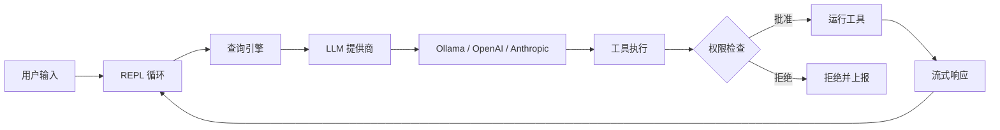

<p align="center">
  
</p>

# OpenHarness

```
        ___
       /   \
      (     )        ___  ___  ___ _  _ _  _   _ ___ _  _ ___ ___ ___
       `~w~`        / _ \| _ \| __| \| | || | /_\ | _ \ \| | __/ __/ __|
       (( ))       | (_) |  _/| _|| .` | __ |/ _ \|   / .` | _|\__ \__ \
        ))((        \___/|_|  |___|_|\_|_||_/_/ \_\_|_\_|\_|___|___/___/
       ((  ))
        `--`
```

终端里的 AI 编程助手。支持任意 LLM —— 免费的本地模型，或任意云端 API。

<p align="center">
  
</p>

[](https://www.npmjs.com/package/@zhijiewang/openharness) [](https://www.npmjs.com/package/@zhijiewang/openharness) [](LICENSE)     [](https://github.com/zhijiewong/openharness) [](https://github.com/zhijiewong/openharness/issues) [](https://github.com/zhijiewong/openharness/pulls)

[English](README.md) | **简体中文**

---

## 目录

- [快速开始](#快速开始)
- [为什么选择 OpenHarness？](#为什么选择-openharness)
- [终端界面](#终端界面)
- [工具（43 个）](#工具43-个)
- [斜杠命令](#斜杠命令)
- [权限模式](#权限模式)
- [钩子](#钩子)
- [检查点与回滚](#检查点与回滚)
- [代理角色](#代理角色)
- [无头模式与 CI/CD](#无头模式)
- [电子宠物 Cybergotchi](#电子宠物-cybergotchi)
- [MCP 服务器](#mcp-服务器)
- [模型提供商](#模型提供商)
- [常见问题](#常见问题)
- [安装](#安装)
- [开发](#开发)
- [贡献](#贡献)
- [社区](#社区)

---

## 快速开始

```bash
npm install -g @zhijiewang/openharness
oh
```

就是这么简单。OpenHarness 会自动检测 Ollama 并开始对话。无需 API 密钥。

**Python SDK：** 我们还提供了官方的 Python SDK，可以在 Python 程序中驱动 `oh`（笔记本、批处理脚本、ML 流水线）。在 npm 安装之后，使用 `pip install openharness-sdk` 安装（PyPI 分发名为 `openharness-sdk`，因为未加后缀的名称已被占用），然后 `from openharness import query`。详见 [`python/README.md`](python/README.md)。

**TypeScript SDK：** 同样有官方的 TypeScript SDK，可以在 Node.js（VS Code 插件、Electron 应用、构建脚本等）中驱动 `oh`：使用 `@zhijiewang/openharness-sdk` —— 通过 `npm install @zhijiewang/openharness-sdk` 安装，然后 `import { query, OpenHarnessClient, tool } from "@zhijiewang/openharness-sdk"`。功能与 Python SDK 对等（流式事件、有状态会话、自定义工具、权限回调、会话恢复）。详见 [`packages/sdk/README.md`](packages/sdk/README.md)。

```bash
oh init                               # 交互式安装向导（模型提供商 + 电子宠物）
oh                                    # 自动检测本地模型
oh --model ollama/qwen2.5:7b         # 指定模型
oh --model gpt-4o                     # 云端模型（需要 OPENAI_API_KEY）
oh --trust                            # 自动批准所有工具调用
oh --auto                             # 自动批准，但阻止危险的 bash 命令
oh -p "fix the tests" --trust         # 无头模式（单次提示后退出）
oh run "review code" --json           # 用于 CI/CD 的 JSON 输出
```

**会话内命令：**
```
/rewind                               # 撤销最近一次 AI 文件变更（恢复检查点）
/roles                                # 列出所有代理专长
/vim                                  # 切换 vim 模式
Ctrl+O                                # 将历史记录刷入终端滚动缓冲区以便查阅
```

## 为什么选择 OpenHarness？

大多数 AI 编程助手要么绑定单一模型提供商，要么每月收费 20 美元以上。OpenHarness 支持任意 LLM —— 可以在本机用 Ollama 免费运行，也可以连接任意云端 API。每一次 AI 编辑都会自动提交到 git，并可以通过 `/undo` 回退。

## 终端界面

OpenHarness 采用受 Ink/Claude Code 默认模式启发的顺序式终端渲染器。已完成的消息会刷入原生的滚动缓冲区（可滚动），而实时区域（流式输出、加载动画、输入框）则通过相对光标移动进行原地重绘。

### 键位绑定

| 按键 | 操作 |
|-----|--------|
| `Enter` | 提交提示词 |
| `Alt+Enter` | 插入换行（多行输入） |
| `↑` / `↓` | 浏览输入历史 |
| `Ctrl+C` | 取消当前请求 / 退出 |
| `Ctrl+A` / `Ctrl+E` | 跳到输入框首 / 尾 |
| `Ctrl+O` | 展开 / 折叠思考块 |
| `Ctrl+K` | 展开 / 折叠消息中的代码块 |
| `Tab` | 自动补全斜杠命令 / 文件路径 / 切换工具输出 |
| `/vim` | 切换 Vim 模式（normal/insert） |

滚动由终端的原生滚动条处理。已完成的消息会进入终端滚动缓冲区。使用终端自带的搜索功能（如 VS Code 中的 `Ctrl+Shift+F`）搜索对话历史。

### 特性

- **Markdown 渲染** —— 标题、代码块、粗体、斜体、列表、表格、引用块、链接
- **语法高亮** —— 关键字、字符串、注释、数字、类型（支持 JS/TS/Python/Rust/Go 等 20+ 种语言）
- **可折叠代码块** —— 超过 8 行的代码块会自动折叠；按 `Ctrl+K` 全部展开
- **可折叠思考块** —— 思考块在完成后会折叠为一行摘要；按 `Ctrl+O` 展开
- **流光加载动画** —— 带颜色过渡的 "Thinking" 指示器（30 秒后洋红 → 黄，60 秒后 → 红）
- **工具调用显示** —— 参数预览、实时流式输出、结果摘要（行数、耗时），按 `Tab` 展开/折叠
- **权限提示** —— 带边框的提示框，按风险级别着色，醒目的 **Y**es/**N**o/**D**iff 按键，内联 diff 带语法高亮
- **状态栏** —— 显示模型名称、token 计数、费用、上下文占用条（可通过配置自定义）
- **上下文告警** —— 上下文窗口超过 75% 时显示黄色警告
- **原生终端滚动条** —— 已完成的消息进入滚动缓冲区；使用终端自带的滚动条与搜索
- **多行输入** —— `Alt+Enter` 插入换行；粘贴时自动识别并插入换行
- **自动补全** —— 斜杠命令与文件路径（带说明）；按 Tab 循环切换
- **文件路径补全** —— Tab 补全路径，并用 `[dir]`/`[file]` 标记类型
- **会话浏览器** —— 使用 `/browse` 交互式浏览并恢复历史会话
- **桌面宠物** —— 页脚中的动画电子宠物 Cybergotchi（通过 `/companion off|on` 切换）

### 主题

```bash
oh --light                    # 适用于明亮终端的浅色主题
/theme light                  # 会话中切换（自动保存）
/theme dark                   # 切回深色
```

主题偏好会保存到 `.oh/config.yaml`，跨会话持久化。

### 自定义状态栏

在 `.oh/config.yaml` 中自定义状态栏格式：

```yaml
statusLineFormat: '{model} │ {tokens} │ {cost} │ {ctx}'
```

可用变量：`{model}`、`{tokens}`（输入↑ 输出↓）、`{cost}`（$X.XXXX）、`{ctx}`（上下文占用条）。空片段会自动折叠。

## 工具（43 个）

| 工具 | 风险 | 描述 |
|------|------|-------------|
| **核心** | | |
| Bash | 高 | 执行 shell 命令并实时流式输出（AST 安全分析） |
| PowerShell | 高 | 执行 PowerShell 命令（Windows 原生脚本） |
| Read | 低 | 按行范围读取文件，支持 PDF |
| ImageRead | 低 | 读取图片/PDF 以进行多模态分析 |
| Write | 中 | 创建或覆盖文件 |
| Edit | 中 | 搜索并替换编辑 |
| MultiEdit | 中 | 原子化的多文件编辑（全部成功或全部失败） |
| Glob | 低 | 按 pattern 查找文件 |
| Grep | 低 | 带上下文行数的正则内容搜索 |
| LS | 低 | 列出目录内容和大小 |
| **Web** | | |
| WebFetch | 中 | 获取 URL 内容（防 SSRF） |
| WebSearch | 中 | 网络搜索 |
| RemoteTrigger | 高 | 向 webhook/API 发送 HTTP 请求 |
| **任务** | | |
| TaskCreate | 低 | 创建结构化任务 |
| TaskUpdate | 低 | 更新任务状态 |
| TaskList | 低 | 列出所有任务 |
| TaskGet | 低 | 获取任务详情 |
| TaskStop | 低 | 停止正在运行的任务 |
| TaskOutput | 低 | 获取任务输出 |
| TodoWrite | 低 | 管理会话级 todo 列表（兼容 Claude Code） |
| **代理** | | |
| Agent | 中 | 派生一个子代理（可指定角色） |
| ParallelAgent | 中 | 派发多个代理并支持 DAG 依赖 |
| SendMessage | 低 | 代理之间的点对点消息 |
| AskUser | 低 | 向用户提问（带选项） |
| **调度** | | |
| CronCreate | 中 | 创建定时任务 |
| CronDelete | 中 | 删除定时任务 |
| CronList | 低 | 列出所有定时任务 |
| ScheduleWakeup | 低 | 在 /loop 中自适应安排下一次触发（缓存感知） |
| **规划** | | |
| EnterPlanMode | 低 | 进入结构化规划模式 |
| ExitPlanMode | 低 | 退出规划模式 |
| **流水线** | | |
| Pipeline | 中 | 顺序执行一连串子任务，把每一步的输出作为下一步的输入 |
| **代码智能** | | |
| Diagnostics | 低 | 基于 LSP 的代码诊断 |
| NotebookEdit | 中 | 编辑 Jupyter notebook |
| **记忆与发现** | | |
| Memory | 低 | 保存/列出/搜索持久化记忆 |
| Skill | 低 | 调用 .oh/skills/ 下的技能 |
| ToolSearch | 低 | 按描述查找工具 |
| SessionSearch | 低 | 在历史会话中搜索相关上下文 |
| **MCP** | | |
| ListMcpResources | 低 | 列出已连接 MCP 服务器上的资源 |
| ReadMcpResource | 低 | 按 URI 读取指定的 MCP 资源 |
| **Git 工作树** | | |
| EnterWorktree | 中 | 创建隔离的 git worktree |
| ExitWorktree | 中 | 移除一个 git worktree |
| **进程** | | |
| KillProcess | 高 | 按 PID 或名称停止进程 |
| Monitor | 中 | 在后台运行命令，并把每一行输出实时反馈给代理 |

低风险只读工具会自动批准。在 `ask` 模式下，中高风险工具需要确认。使用 `--trust` 或 `--auto` 可跳过提示。

## 斜杠命令

OH 注册了 80+ 个斜杠命令；下表只列出最常用的一部分。在会话中运行 `/help` 可以看到完整列表。别名：`/q` 退出、`/h` 帮助、`/c` 提交、`/m` 模型、`/s` 状态。

**会话：**
| 命令 | 描述 |
|---------|-------------|
| `/clear` | 清空对话历史 |
| `/compact` | 压缩对话以释放上下文 |
| `/export` | 将对话导出为 markdown |
| `/history [n]` | 列出最近的会话；`/history search <term>` 搜索 |
| `/browse` | 带预览的交互式会话浏览器 |
| `/resume <id>` | 恢复已保存的会话 |
| `/fork` | 克隆当前会话 |

**Git：**
| 命令 | 描述 |
|---------|-------------|
| `/diff` | 显示未提交的 git 变更 |
| `/undo` | 撤销最后一次 AI 提交 |
| `/commit [msg]` | 创建 git 提交 |
| `/log` | 显示最近的 git 提交 |

**信息：**
| 命令 | 描述 |
|---------|-------------|
| `/help` | 显示所有可用命令（按分类） |
| `/cost` | 显示会话费用与 token 用量 |
| `/status` | 显示模型、模式、git 分支、MCP 服务器 |
| `/config` | 显示配置 |
| `/files` | 列出上下文中的文件 |
| `/model <name>` | 会话中切换模型 |
| `/memory` | 查看并搜索记忆 |
| `/doctor` | 运行诊断健康检查 |
| `/hooks` | 按事件列出已加载的钩子 |

**设置：**
| 命令 | 描述 |
|---------|-------------|
| `/theme dark\|light` | 切换主题（自动保存到配置） |
| `/vim` | 切换 Vim 模式 |
| `/companion off\|on` | 切换电子宠物可见性 |

**AI：**
| 命令 | 描述 |
|---------|-------------|
| `/plan <task>` | 进入规划模式 |
| `/review` | 审查最近的代码变更 |

**宠物：**
| 命令 | 描述 |
|---------|-------------|
| `/cybergotchi` | 喂食、抚摸、休息、状态、改名或重置电子宠物 |

## 权限模式

控制 OpenHarness 自动批准工具调用的激进程度：

| 模式 | 参数 | 行为 |
|------|------|----------|
| `ask` | `--permission-mode ask` | 中/高风险操作会提示（默认） |
| `trust` | `--trust` | 自动批准一切 |
| `deny` | `--deny` | 仅允许低风险只读操作 |
| `acceptEdits` | `--permission-mode acceptEdits` | 自动批准文件编辑，Bash/WebFetch/Agent 仍会询问 |
| `plan` | `--permission-mode plan` | 只读模式 —— 阻止所有写操作 |
| `auto` | `--auto` | 自动批准所有操作，阻止危险 bash（经 AST 分析） |
| `bypassPermissions` | `--permission-mode bypassPermissions` | 无条件批准一切（仅用于 CI） |

Bash 命令由一个轻量级 AST 解析器分析，可识别破坏性模式（`rm -rf`、`git push --force`、`curl | bash` 等）并相应调整风险级别。

在 `.oh/config.yaml` 中永久设置：`permissionMode: 'acceptEdits'`

## 钩子

通过在 `.oh/config.yaml` 中添加 `hooks` 块，在关键会话事件触发时自动运行 shell 脚本：

```yaml
hooks:
  - event: sessionStart
    command: "echo 'Session started' >> ~/.oh/session.log"

  - event: preToolUse
    command: "scripts/check-tool.sh"
    match: Bash   # 可选：仅对该工具名触发

  - event: postToolUse
    command: "scripts/after-tool.sh"

  - event: sessionEnd
    command: "scripts/cleanup.sh"
```

**事件类型**（共 17 个）：

| 事件 | 触发时机 | 是否可阻止 |
|-------|---------------|------------|
| `sessionStart` | 会话开始 | — |
| `sessionEnd` | 会话结束 | — |
| `turnStart` | 顶层代理回合开始（用户提示词被接受后） | — |
| `turnStop` | 顶层代理回合结束（对应 Claude Code 的 `Stop`） | — |
| `userPromptSubmit` | 用户提示词到达 LLM 之前 | 是 —— `decision: deny` |
| `preToolUse` | 工具调用之前 | 是 —— 退出码 1 / `decision: deny` |
| `postToolUse` | 工具成功执行之后 | — |
| `postToolUseFailure` | 工具抛错或返回 `isError: true` | — |
| `permissionRequest` | 工具需要授权时（`preToolUse` 与询问之间） | 是 —— `decision: allow\|deny\|ask` |
| `fileChanged` | 工具修改文件之后 | — |
| `cwdChanged` | 工作目录变更之后 | — |
| `subagentStart` | 子代理被派生 | — |
| `subagentStop` | 子代理完成 | — |
| `preCompact` | 对话压缩之前 | — |
| `postCompact` | 对话压缩之后 | — |
| `configChange` | 会话过程中 `.oh/config.yaml` 被修改 | — |
| `notification` | 通知被派发 | — |

实时查看：在会话中运行 `/hooks` 可以按事件分组查看当前已加载的钩子。

**环境变量**（钩子脚本可用）：

| 变量 | 描述 |
|----------|-------------|
| `OH_EVENT` | 事件类型（`sessionStart`、`preToolUse` 等） |
| `OH_TOOL_NAME` | 正在调用的工具名（仅工具类事件） |
| `OH_TOOL_ARGS` | JSON 编码的工具参数（仅工具类事件） |
| `OH_TOOL_OUTPUT` | JSON 编码的工具输出（仅 `postToolUse`） |
| `OH_TOOL_INPUT_JSON` | 完整的 JSON 工具输入（仅工具类事件） |
| `OH_SESSION_ID` / `OH_MODEL` / `OH_PROVIDER` / `OH_PERMISSION_MODE` | 当前会话上下文 |
| `OH_COST` / `OH_TOKENS` | 累计费用与 token 数 |
| `OH_FILE_PATH` | 变更的文件路径（仅 `fileChanged`） |
| `OH_NEW_CWD` | 新的工作目录（仅 `cwdChanged`） |
| `OH_TURN_NUMBER` / `OH_TURN_REASON` | 回合边界上下文（`turnStart` / `turnStop`） |

使用 `match` 将钩子限定到特定工具名（例如 `match: Bash` 仅对 Bash 工具触发）。支持子串、glob（如 `Cron*`）和 `/regex/flags` 三种匹配方式。

将 `command` 钩子设置 `jsonIO: true` 即可启用结构化 JSON I/O —— 框架在 stdin 上发送 `{event, ...context}`，并从 stdout 读取 `{decision, reason, hookSpecificOutput}`。HTTP 钩子接受同样的响应格式。完整参考见 [docs/hooks.md](docs/hooks.md)。

## 电子宠物 Cybergotchi

OpenHarness 自带一只拓麻歌子（Tamagotchi）风格的电子宠物，住在侧边面板里。它会实时对你的会话做出反应 —— 为连胜欢呼、为工具失败抱怨、被冷落时会饿。

**孵化一只：**
```
oh init        # 安装向导包含电子宠物设置
/cybergotchi   # 或在会话中孵化
```

**命令：**
```
/cybergotchi feed      # 饱食度 +30
/cybergotchi pet       # 快乐值 +20
/cybergotchi rest      # 精力值 +40
/cybergotchi status    # 显示需求与终生统计
/cybergotchi rename    # 起个新名字
/cybergotchi reset     # 换个物种重新开始
```

**需求**会随时间衰减（饱食度最快，快乐值最慢）。按时喂食、抚摸你的宠物，让它保持开心。

**进化** —— 基于终生里程碑进化：
- 阶段 1（✦ 洋红）：10 次会话或 50 次提交
- 阶段 2（★ 黄色 + 皇冠）：完成 100 个任务，或连续 25 次工具调用无失败

**18 个物种**可选：鸭、猫、猫头鹰、企鹅、兔、龟、蜗牛、章鱼、美西螈、仙人掌、蘑菇、胖团子、水豚、鹅等等。

## MCP 服务器

通过编辑 `.oh/config.yaml` 接入任意 MCP（Model Context Protocol）服务器：

```yaml
provider: anthropic
model: claude-sonnet-4-6
permissionMode: ask
mcpServers:
  - name: filesystem
    command: npx
    args: ["-y", "@modelcontextprotocol/server-filesystem", "/tmp"]
  - name: github
    command: npx
    args: ["-y", "@modelcontextprotocol/server-github"]
    env:
      GITHUB_PERSONAL_ACCESS_TOKEN: ghp_...
```

MCP 工具会与内置工具并列出现。`/status` 会显示已连接的服务器。

### 远程 MCP 服务器（HTTP / SSE）

```yaml
mcpServers:
  - name: linear
    type: http
    url: https://mcp.linear.app/mcp
    headers:
      Authorization: "Bearer ${LINEAR_API_KEY}"
```

完整参考见 [docs/mcp-servers.md](docs/mcp-servers.md)。
OAuth 2.1 设置见 [docs/mcp-servers.md](docs/mcp-servers.md#authentication)（收到 401 时自动触发；另有 `/mcp-login` 和 `/mcp-logout` 命令）。

**MCP 服务器注册表** —— 从精选目录中浏览并安装：

```
/mcp-registry              # 浏览所有可用服务器
/mcp-registry github       # 显示指定服务器的安装配置
/mcp-registry database     # 按分类搜索
```

分类：filesystem、git、database、api、search、productivity、dev-tools、ai。

## Git 集成

在 git 仓库中，OpenHarness 会自动提交 AI 编辑：

```
oh: Edit src/app.ts                    # 自动以 "oh:" 前缀提交
oh: Write tests/app.test.ts
```

- 每次 AI 文件变更都会自动提交
- `/undo` 会回退最后一次 AI 提交（仅限 OH 提交，不会动你的）
- `/diff` 显示变更内容
- 你的未提交文件是安全的 —— 会在 AI 编辑前先单独提交

## 检查点与回滚

每次文件修改都会在执行前自动打检查点。如果出了问题：

```
/rewind           # 从最近一次检查点恢复文件
/undo             # 回退最后一次 AI git 提交
```

检查点保存在 `.oh/checkpoints/` 中，覆盖 FileWrite、FileEdit 以及会修改文件的 Bash 命令。

## 校验循环

每次文件编辑（Edit、Write、MultiEdit）之后，openHarness 会自动运行语言相关的 lint/类型检查命令，并把结果反馈回代理的上下文。这是影响最大的单一 harness 工程模式 —— 研究表明，自动反馈能带来 2-3 倍的质量提升。

**自动检测** —— 如果你的项目有 `tsconfig.json`、`.eslintrc*`、`pyproject.toml`、`go.mod` 或 `Cargo.toml`，校验规则会被自动识别。无需配置。

**自定义规则**（在 `.oh/config.yaml` 中）：

```yaml
verification:
  enabled: true       # 默认：true（自动检测）
  mode: warn          # 'warn' 追加到输出；'block' 标记为错误
  rules:
    - extensions: [".ts", ".tsx"]
      lint: "npx tsc --noEmit 2>&1 | head -20"
      timeout: 15000
    - extensions: [".py"]
      lint: "ruff check {file} 2>&1 | head -10"
```

每次编辑后，代理会看到 `[Verification passed]` 或带 linter 输出的 `[Verification FAILED]`，从而自我修正。

## 记忆整理

会话退出时，openHarness 会按时间衰减自动剔除过期记忆：

- 30 天以上未访问的记忆，每 30 天衰减 0.1 相关度
- 相关度低于 0.1 的记忆会被永久删除
- 更新后的相关度分数会写回记忆文件

这能让记忆系统保持精简且相关。在 `.oh/config.yaml` 中配置：

```yaml
memory:
  consolidateOnExit: true   # 默认：true
```

## 定时任务（Cron）

创建会在后台自动运行的定时任务：

```
# 通过斜杠命令
/cron list                    # 显示所有定时任务
/cron create "check-tests"    # 新建任务（交互式）
/cron delete <id>             # 删除任务
```

**调度语法：** `every 5m`、`every 2h`、`every 1d`

Cron 执行器每 60 秒检查一次到期任务，并通过子查询运行。结果保存到 `~/.oh/crons/history/`。

## 代理角色

派发专职子代理来处理特定任务：

```
/roles            # 列出所有可用角色
```

| 角色 | 描述 | 工具 |
|------|-------------|-------|
| `code-reviewer` | 找出 bug、安全问题、风格问题 | 只读 |
| `test-writer` | 生成单元测试和集成测试 | 读 + 写 |
| `docs-writer` | 撰写文档与注释 | 读 + 写 + 编辑 |
| `debugger` | 系统化排查 bug | 只读 + Bash |
| `refactorer` | 在不改变行为的前提下简化代码 | 全部文件工具 + Bash |
| `security-auditor` | OWASP、注入、密钥、CVE 扫描 | 只读 + Bash |
| `evaluator` | 评估代码质量并运行测试（只读） | 只读 + Bash + Diagnostics |
| `planner` | 设计分步实现计划 | 只读 + Bash |
| `architect` | 分析架构、设计结构性变更 | 只读 |
| `migrator` | 系统化的代码库迁移与升级 | 全部文件工具 + Bash |

每个角色只会让子代理使用其推荐的工具。你也可以显式传入 `allowed_tools`：

```
Agent({ subagent_type: 'evaluator', prompt: 'Run all tests and report results' })
Agent({ allowed_tools: ['Read', 'Grep'], prompt: 'Search for all TODO comments' })
```

## 无头模式

跑一次提示词，不走交互 UI —— 适合 CI/CD 和脚本化：

```bash
# 推荐：chat 命令加 -p 参数
oh -p "fix the failing tests" --model ollama/llama3 --trust
oh -p "review src/query.ts" --auto --output-format json

# 替代：run 命令
oh run "fix the failing tests" --model ollama/llama3 --trust
oh run "add error handling to api.ts" --json    # JSON 输出

# 通过 stdin 输入
cat error.log | oh run "what's wrong here?"
git diff | oh run "review these changes"
```

### 使用 `--json-schema` 约束结构化输出

按 JSON Schema 约束模型输出。适用于需要以编程方式解析模型输出、避免正则启发式的 CI 脚本：

```bash
oh -p "output {\"ok\": true, \"count\": 3} as JSON" \
  --trust \
  --json-schema '{"type":"object","properties":{"ok":{"type":"boolean"},"count":{"type":"integer"}},"required":["ok","count"]}'
```

行为：
- stdout：校验通过时输出单行的 JSON。
- stderr：失败时输出结构化错误，并附带原始模型输出以便调试。
- 退出码：**0** 校验通过，**2** schema 本身不合法，**3** 模型输出不是合法 JSON，**4** JSON 不匹配 schema。

支持的关键字：`type`、`properties`、`required`、`items`、`enum`。如需更完整的校验，请通过管道交给专用校验器。

### 用于 PR 审查的 GitHub Action

OpenHarness 自带用于自动代码审查的 GitHub Action：

```yaml
# .github/workflows/ai-review.yml
on:
  pull_request:
    types: [opened, synchronize]

jobs:
  review:
    runs-on: ubuntu-latest
    steps:
      - uses: actions/checkout@v4
        with:
          fetch-depth: 0
      - uses: ./.github/actions/review
        with:
          model: 'claude-sonnet-4-6'
          anthropic_api_key: ${{ secrets.ANTHROPIC_API_KEY }}
```

成功退出码 0，失败 1。

## 模型提供商

```bash
# 本地（免费，无需 API key）
oh --model ollama/llama3
oh --model ollama/qwen2.5:7b

# 云端
OPENAI_API_KEY=sk-... oh --model gpt-4o
ANTHROPIC_API_KEY=sk-ant-... oh --model claude-sonnet-4-6
OPENROUTER_API_KEY=sk-or-... oh --model openrouter/meta-llama/llama-3-70b

# llama.cpp / GGUF
oh --model llamacpp/my-model

# LM Studio
oh --model lmstudio/my-model
```

### llama.cpp / GGUF（本地，无需 Ollama）

通过 `llama-server` 直接支持 GGUF，避免 Ollama 的额外开销。对大模型通常更快。

**前置条件：**
- 安装 llama.cpp：`brew install llama.cpp`，或从 [github.com/ggml-org/llama.cpp](https://github.com/ggml-org/llama.cpp) 下载
- 下载一个 GGUF 模型（例如从 [HuggingFace](https://huggingface.co)）

**启动 llama-server：**
```bash
llama-server --model ./your-model.gguf --port 8080 --alias my-model
```

**通过 `oh init` 配置：**
- 运行 `oh init`，在提示时选择 "llama.cpp / GGUF"

**或手动配置** `.oh/config.yaml`：
```yaml
provider: llamacpp
model: my-model
baseUrl: http://localhost:8080
permissionMode: ask
```

**运行：**
```bash
oh
oh --model llamacpp/my-model
oh models                    # 列出可用模型
```

## 配置层级

配置按层加载（后者覆盖前者）：

1. **全局** `~/.oh/config.yaml` —— 所有项目共用的默认提供商、模型、主题
2. **项目** `.oh/config.yaml` —— 项目级设置
3. **本地** `.oh/config.local.yaml` —— 个人覆盖（已 gitignore）

全局设置一次默认提供商：

```yaml
# ~/.oh/config.yaml
provider: ollama
model: llama3
permissionMode: ask
theme: dark
language: zh-CN        # 可选 —— 模型会用该语言回复（代码、命令、路径保持原样）
outputStyle: default   # 可选 —— "default"、"explanatory"、"learning" 或自定义名
```

之后项目配置只需写不同之处：

```yaml
# .oh/config.yaml
model: codellama   # 仅覆盖模型
```

### 输出风格（Output Styles）

在不修改核心指令的前提下切换代理的"性格"。内置风格：

- **`default`** —— 标准的软件工程助手（无前置）
- **`explanatory`** —— 每完成一个任务后追加 `## Insights` 小节，解释 *为什么* 做出这样的选择
- **`learning`** —— 在关键位置留 1–3 个 `TODO(human)` 标记，把最有学习价值的那部分代码留给你自己写

自定义风格是带 YAML frontmatter 的 markdown 文件。保存到 `.oh/output-styles/<name>.md`（项目级）或 `~/.oh/output-styles/<name>.md`（用户级）。项目级 > 用户级 > 内置。

````markdown
---
name: code-review
description: 专注的代码审查模式
---

严格审查。对每个函数追问：逻辑是否正确？错误处理是否完整？有没有遗漏的边界情况？
````

在 `.oh/config.yaml` 中通过 `outputStyle: code-review` 激活。

## 项目规则

在任意仓库中创建 `.oh/RULES.md`（或运行 `oh init`）：

```markdown
- Always run tests after changes
- Use strict TypeScript
- Never commit to main directly
```

规则会自动加载到每次会话中。

## 技能与插件

### 技能

技能是带 YAML frontmatter 的 markdown 文件，用于添加可复用行为：

```markdown
---
name: deploy
description: Deploy the application to production
trigger: deploy
tools: [Bash, Read]
---

Run the deploy script with health checks...
```

**查找位置**（按顺序）：
1. `.oh/skills/` —— 项目级技能
2. `~/.oh/skills/` —— 全局技能（在所有项目中可用）

当用户消息中包含 trigger 关键字时，技能会自动触发；也可以用 `/skill deploy` 显式调用。

### 插件

插件是打包了技能、钩子和 MCP 服务器的 npm 包：

```json
{
  "name": "my-openharness-plugin",
  "version": "1.0.0",
  "skills": ["skills/deploy.md", "skills/review.md"],
  "hooks": {
    "sessionStart": "scripts/setup.sh"
  },
  "mcpServers": [
    { "name": "my-api", "command": "npx", "args": ["-y", "@my-org/mcp-server"] }
  ]
}
```

把它命名为 `openharness-plugin.json` 放在 npm 包根目录。安装时 `npm install`，openHarness 会自动从 `node_modules/` 中发现它。

## 工作原理



## 常见问题

**可以离线使用吗？**
可以。用 Ollama 加一个本地模型 —— 不需要网络，也不需要 API key。

**要多少钱？**
免费。OpenHarness 使用 MIT 协议。云端模型自带 API key（BYOK），或者用 Ollama 完全免费。

**安全吗？**
安全。7 种权限模式控制工具能做什么。Bash 命令由 AST 解析器分析，阻止破坏性模式（`rm -rf`、`curl | bash` 等）。每次文件变更都会打检查点，可通过 `/rewind` 回滚。

**可以在 CI/CD 中使用吗？**
可以。用 `oh -p "prompt" --auto` 跑无头模式，或用自带的 GitHub Action 做 PR 审查。

**支持我的语言/框架吗？**
支持。OpenHarness 与语言无关 —— 它能读写并执行任意语言的代码。语法高亮覆盖 20+ 种语言。

**与 Claude Code 相比如何？**
CLI 使用场景下约 95% 功能对等。主要优势：兼容任意 LLM（不止 Anthropic），且采用 MIT 协议。见上文 [为什么选择 OpenHarness？](#为什么选择-openharness)。

## 安装

需要 **Node.js 18+**。

```bash
# 从 npm 安装
npm install -g @zhijiewang/openharness

# 从源码安装
git clone https://github.com/zhijiewong/openharness.git
cd openharness
npm install && npm install -g .
```

## 开发

```bash
npm install
npx tsx src/main.tsx              # 以开发模式运行
npx tsc --noEmit                  # 类型检查
npm test                          # 运行测试
```

### 添加工具

在 `src/tools/YourTool/index.ts` 中实现 `Tool` 接口（配合 Zod 输入 schema），然后在 `src/tools.ts` 中注册。

### 添加模型提供商

在 `src/providers/yourprovider.ts` 中实现 `Provider` 接口，然后在 `src/providers/index.ts` 中添加一个 case。

## 贡献

见 [CONTRIBUTING.md](CONTRIBUTING.md)。

## 社区

加入 OpenHarness 社区，一起获取帮助、分享工作流、讨论 AI 编程助手的未来！

| 平台 | 详情与链接 |
| :--- | :--- |
| 🟣 **Discord** | [**加入我们的 Discord**](https://discord.gg/ezVrqy3qu)，和开发者实时交流、获取支持。 |
| 🔵 **飞书 / Lark** | 扫描下方二维码加入社区协作群：<br><br> |
| 🟢 **微信** | 扫描下方二维码加入微信群：<br><br> |

## 许可证

MIT
